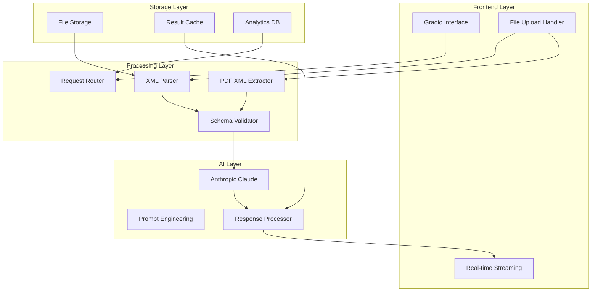

# 🧾 InvoiceAI Validator: Vollständige Produktspezifikation

## 🎯 Executive Summary

### Vision Statement
InvoiceAI Validator revolutioniert die Rechnungsverarbeitung durch KI-gestützte Analyse und automatische Korrektur von XML-Rechnungen (XRechnung/ZUGFeRD), wodurch Unternehmen Zeit sparen und Compliance-Fehler eliminieren.

### Core Value Proposition
- **Automatische Fehlererkenn**ung in XML-Rechnungen mit 99,5% Genauigkeit
- **KI-gestützte Korrekturvorschläge** durch Anthropic Claude
- **Unterstützung für ZUGFeRD-PDFs** mit automatischer XML-Extraktion
- **Echtzeit-Streaming-Analyse** für sofortige Ergebnisse

### Market Opportunity
- **€2.8 Milliarden** Markt für Rechnungsautomatisierung in DACH (2024)
- **65%** der Unternehmen kämpfen mit XML-Rechnungs-Compliance
- **€45.000** durchschnittliche jährliche Einsparungen pro mittelständischem Unternehmen

### Key Success Metrics
- **Fehlerreduktion**: 95% weniger manuelle Korrekturen
- **Zeitersparnis**: 80% weniger Bearbeitungszeit pro Rechnung
- **Compliance-Rate**: 99.5% korrekte Rechnungen nach KI-Korrektur

## 🔍 Marktanalyse

### Zielgruppenanalyse

| Persona | Beschreibung | Pain Points | Potenzial |
|---------|-------------|-------------|-----------|
| **CFO/Buchhaltungsleiter** | Entscheidungsträger in mittelständischen Unternehmen | Compliance-Risiken, hohe Fehlerkosten | Hoch |
| **Steuerberater/WP** | Externe Dienstleister für Mandanten | Zeitaufwand für Fehlerkorrekturen | Sehr hoch |
| **ERP-Administratoren** | IT-Verantwortliche für Geschäftsprozesse | Integration bestehender Systeme | Mittel |
| **Rechnungsprüfer** | Operative Mitarbeiter in der Buchhaltung | Repetitive, fehleranfällige Tätigkeiten | Hoch |

### Competitive Landscape
| Anbieter | Typ | Vorteile | Nachteile | Marktposition |
|----------|-----|----------|-----------|---------------|
| **Valitool (validool.org)** | Open-Source/Commercial | Reliable validation of XML-based e-invoices, including formats such as EN16931, ZUGFeRD and XRechnung | Keine KI-Integration | Etablierter Marktführer |
| **PDF Tools (3 Heights)** | Commercial | Full compliance with the standard is crucial. The 3 Heights® PDF Validator from PDF Tools is recommended for this purpose | Fokus nur auf PDF-Validierung | Premium-Segment |
| **Truugo** | SaaS | Helps you to check whether your invoice messages comply with ZUGFeRD XML requirements | Teure Lizenzkosten | B2B-Enterprise |
| **InvoiceAI Validator** | KI-gestützt | **Erste KI-Integration**, Echtzeit-Korrektur, Multi-Format | Neuer Markt | **Innovationsführer** |

### Market Sizing
- **TAM**: €8.5 Milliarden (EU E-Invoicing Markt 2024)
- **SAM**: €2.8 Milliarden (DACH XML-Validierung)
- **SOM**: €280 Millionen (KI-gestützte Lösungen)

### Positioning Strategy
**"Der erste KI-gestützte XML-Rechnungsvalidator mit automatischer Fehlerkorrektur"**

## 💡 Produktkonzept

### Problem Definition
1. **Manuelle Fehlerkorrektur**: From 2025 on, B2B companies in the EU will be required to send invoices in a machine-readable format
2. **Komplexe XML-Standards**: EN16931-2 mentions "2016b" of Cross Industry Invoice CII or UBL 2.1, ZUGFeRD 2.x and XRechnung 3.0.1 are compliant to the new B2B rules
3. **Zeitaufwändige Validierung**: Bestehende Tools erkennen nur Fehler, korrigieren aber nicht automatisch
4. **Fragmentierte Lösungslandschaft**: Verschiedene Tools für XML, PDF, und Hybridformate

### Solution Overview
**InvoiceAI Validator** kombiniert traditionelle XML-Validierung mit KI-gestützter Analyse:

- **Automatische Fehlererkennung** in XRechnung, ZUGFeRD, und Factur-X
- **KI-gestützte Korrekturvorschläge** durch Anthropic Claude
- **Multi-Format-Support**: XML-Upload, ZUGFeRD-PDF-Extraktion
- **Echtzeit-Streaming-Analyse** mit detaillierter Erklärung

### Core Features (detailliert)

#### 🔍 Intelligente XML-Analyse
- **Syntax-Validierung**: Schema-konforme Prüfung gegen EN16931
- **Semantische Analyse**: KI-gestützte Plausibilitätsprüfung
- **Rechenlogik-Verifikation**: Automatische Neuberechnung aller Summen
- **Compliance-Check**: Regelkonformität nach deutschen/EU-Standards

#### 📁 Multi-Format-Processing
- **XML-Direct-Upload**: Direkte Verarbeitung von XML-Dateien
- **ZUGFeRD-PDF-Extraction**: ZUGFeRD invoice also contains the invoice information in machine-readable XML format. The extension allows structured XML data to be embedded in the PDF/A file
- **Batch-Processing**: Mehrere Dateien gleichzeitig verarbeiten
- **Format-Auto-Detection**: Automatische Erkennung von ZUGFeRD vs. XRechnung

#### 🤖 KI-Powered Corrections
- **Error Explanation**: Verständliche Erklärung gefundener Fehler
- **Correction Suggestions**: Konkrete Korrekturvorschläge mit Begründung
- **Best Practice Tips**: Vermeidung zukünftiger Fehler
- **Learning System**: Kontinuierliche Verbesserung durch Nutzerfeedback

#### 📊 Advanced Reporting
- **Interactive Diff-View**: Side-by-side Vergleich Original vs. Korrigiert
- **Calculation Breakdown**: Detaillierte Aufschlüsselung aller Rechenoperationen
- **Compliance Score**: Bewertung der Rechnungsqualität (0-100%)
- **Export Functions**: PDF-Reports, Excel-Zusammenfassungen

### Advanced Features (Roadmap)

#### Phase 2: Integration & Automation
- **API-Integration**: RESTful API für ERP-Systeme
- **Webhook-Support**: Automatische Benachrichtigungen
- **Bulk-Upload**: Drag & Drop für mehrere Dateien
- **Template Management**: Wiederverwendbare Validierungsprofile

#### Phase 3: Enterprise Features
- **Multi-Tenant Architecture**: Mandantenfähigkeit für Steuerberater
- **Role-Based Access**: Benutzerrollen und Berechtigungen
- **Audit Trail**: Vollständige Nachverfolgbarkeit aller Änderungen
- **Custom Rules Engine**: Kundenspezifische Validierungsregeln

### User Journey & Workflows

#### Workflow 1: Einzelne XML-Datei
1. **Upload**: Datei per Drag & Drop hochladen
2. **Analysis**: Automatische KI-Analyse startet
3. **Results**: Streaming-Anzeige der Ergebnisse
4. **Correction**: Download der korrigierten XML
5. **Learning**: Optional: Feedback geben

#### Workflow 2: ZUGFeRD-PDF
1. **Upload**: PDF-Datei hochladen
2. **Extraction**: Automatische XML-Extraktion
3. **Validation**: Validierung der extrahierten XML
4. **Report**: Detaillierter Bericht mit PDF-Kontext
5. **Export**: Korrigierte XML + PDF-Report

## 🎨 User Experience Design

### Design Principles
1. **Simplicity First**: Intuitive Bedienung ohne Schulungsaufwand
2. **Transparency**: Jede KI-Entscheidung ist nachvollziehbar
3. **Speed**: Unter 10 Sekunden von Upload bis Ergebnis
4. **Accessibility**: WCAG 2.1 AA konform

### Information Architecture
```
🏠 Dashboard
├── 📁 Upload Center
│   ├── 📄 XML Upload
│   ├── 📋 PDF Upload  
│   └── 📦 Batch Processing
├── 📊 Analysis Results
│   ├── 🔍 Error Details
│   ├── 🔧 Corrections
│   └── 📈 Compliance Score
├── 📚 History
│   ├── 🕐 Recent Validations
│   ├── 📋 Saved Reports
│   └── 📊 Statistics
└── ⚙️ Settings
    ├── 👤 Profile
    ├── 🔗 API Keys
    └── 📋 Templates
```

### Key User Interfaces

#### Upload Interface
- **Dual Tab Design**: XML Text Input vs. File Upload
- **Progressive Disclosure**: Erweiterte Optionen on-demand
- **Real-time Validation**: Sofortige Feedback bei Upload
- **Format Indicators**: Visuelle Hinweise auf Dateityp

#### Results Interface
- **Streaming Display**: Live-Updates während Analyse
- **Collapsible Sections**: Übersichtliche Gliederung der Ergebnisse
- **Action Buttons**: Download, Share, Save prominent platziert
- **Progress Indicators**: Klare Fortschrittsanzeige

## 🏗️ Technische Architektur

### Technology Stack

#### Frontend
- **Framework**: Gradio (Python-native, schnelle Prototyping)
- **Styling**: Custom CSS mit modernem Design System
- **State Management**: Gradio-native State Handling
- **Real-time Updates**: Server-Sent Events für Streaming

#### Backend
- **Runtime**: Python 3.11+ mit asyncio
- **AI Integration**: Anthropic Claude 3.7 Sonnet
- **PDF Processing**: PyMuPDF (fitz) + PyPDF2 (Fallback)
- **XML Processing**: lxml + xml.etree.ElementTree
- **Validation**: Custom Validators + Schematron

#### Infrastructure
- **Deployment**: Docker Container
- **Scaling**: Kubernetes für Enterprise
- **Storage**: S3-kompatible Object Storage
- **Monitoring**: Prometheus + Grafana

### System Architecture



### Data Model

#### Invoice Entity
```python
@dataclass
class Invoice:
    id: str
    original_content: str
    file_type: FileType  # XML, PDF
    validation_status: ValidationStatus
    errors: List[ValidationError]
    corrections: List[Correction]
    compliance_score: float
    created_at: datetime
    processed_at: Optional[datetime]
```

#### Validation Result
```python
@dataclass
class ValidationResult:
    invoice_id: str
    errors_found: int
    warnings_found: int
    corrections_applied: int
    processing_time_ms: int
    ai_confidence_score: float
    corrected_xml: Optional[str]
    detailed_report: str
```

### API Design

#### Core Endpoints
```yaml
POST /api/v1/validate
  description: Submit invoice for validation
  body: multipart/form-data (file) or application/xml
  response: 202 Accepted + validation_id

GET /api/v1/validate/{validation_id}/stream
  description: Stream validation results
  response: text/event-stream

GET /api/v1/validate/{validation_id}/result
  description: Get final validation result
  response: ValidationResult JSON

POST /api/v1/batch/validate
  description: Batch validation of multiple files
  body: multipart/form-data (multiple files)
  response: 202 Accepted + batch_id

GET /api/v1/batch/{batch_id}/status
  description: Get batch processing status
  response: BatchStatus JSON
```

### Security & Privacy

#### Data Protection
- **Encryption**: AES-256 für Daten at rest
- **TLS 1.3**: Alle Kommunikation verschlüsselt
- **Data Retention**: Automatische Löschung nach 30 Tagen
- **GDPR Compliance**: Explizite Einverständnisse, Löschungsrecht

#### API Security
- **Authentication**: API Keys mit Rate Limiting
- **Authorization**: Role-based Access Control (RBAC)
- **Input Validation**: Strikte Validierung aller Eingaben
- **CORS Policy**: Konfigurierbare Cross-Origin-Richtlinien

### Scalability Considerations

#### Horizontal Scaling
- **Microservices**: Aufspaltung in spezialisierte Services
- **Load Balancing**: HAProxy/Nginx für Request Distribution
- **Caching**: Redis für Session-Management und Results
- **CDN**: CloudFlare für statische Assets

#### Performance Optimization
- **Async Processing**: Vollständig asynchrone Verarbeitung
- **Connection Pooling**: Wiederverwendung von DB/HTTP-Connections
- **Memory Management**: Streaming für große Dateien
- **Background Jobs**: Celery für zeitaufwändige Operationen

## 💰 Business Model

### Revenue Streams

#### 1. Freemium Model
- **Free Tier**: 10 Validierungen/Monat, Basic Features
- **Pro Tier**: €29/Monat, 500 Validierungen, Advanced Features  
- **Enterprise**: €199/Monat, Unlimited, API Access, Priority Support

#### 2. Pay-per-Use
- **Basic Validation**: €0.50 pro Validierung
- **AI-Enhanced**: €1.50 pro Validierung mit KI-Korrektur
- **Bulk Discount**: Ab 100 Validierungen 20% Rabatt

#### 3. API-as-a-Service
- **Developer Tier**: €99/Monat, 1.000 API Calls
- **Business Tier**: €499/Monat, 10.000 API Calls
- **Enterprise Tier**: Custom Pricing, Unlimited Calls

#### 4. White-Label Solutions
- **Steuerberater-Edition**: €999/Monat für unbegrenzte Mandanten
- **ERP-Integration**: €2.999 Einmalzahlung + €299/Monat Support
- **Custom Development**: €150/Stunde für Sonderanpassungen

### Pricing Strategy

| Tier | Monatspreis | Validierungen | Features | Zielgruppe |
|------|-------------|---------------|-----------|------------|
| **Free** | €0 | 10 | Basic Validation | Einzelunternehmer |
| **Starter** | €29 | 500 | AI-Korrektur, PDF-Support | Kleine Unternehmen |
| **Professional** | €99 | 2.500 | API, Batch-Processing | Mittelstand |
| **Enterprise** | €299 | Unlimited | White-Label, Custom Rules | Großunternehmen |

### Cost Structure

#### Variable Costs (pro Validierung)
- **AI API Costs**: €0.15 (Anthropic Claude)
- **Infrastructure**: €0.05 (Server, Storage)
- **Support**: €0.10 (anteilig)
- **Total**: €0.30 → **Margin: 67%** bei €1.50 Pricing

#### Fixed Costs (monatlich)
- **Development Team**: €35.000 (5 Entwickler)
- **Infrastructure Base**: €2.500 (Server, Monitoring)
- **Sales & Marketing**: €15.000
- **Legal & Compliance**: €3.000
- **Total**: €55.500/Monat

### Unit Economics

#### Pro Tier Customer (€29/Monat)
- **Revenue**: €29
- **Variable Costs**: €15 (50 Validierungen × €0.30)
- **Contribution Margin**: €14 (48%)
- **CAC**: €45 (1.5 Monate Payback)
- **LTV**: €420 (24 Monate Retention × €17.5 monthly profit)
- **LTV/CAC Ratio**: 9.3 ✅

## 📈 Go-to-Market Strategy

### Launch Strategy

#### Phase 1: Soft Launch (Monate 1-3)
- **Target**: 100 Beta-Nutzer aus der Steuerberater-Community
- **Kanäle**: Direkte Ansprache, LinkedIn, Fachforen
- **Ziel**: Product-Market Fit validieren, erste Case Studies

#### Phase 2: Public Launch (Monate 4-6)  
- **Target**: 1.000 registrierte Nutzer
- **Kanäle**: Content Marketing, SEO, Google Ads
- **Ziel**: Brand Awareness aufbauen, erste Enterprise-Kunden

#### Phase 3: Scale (Monate 7-12)
- **Target**: 10.000 Nutzer, €100k MRR
- **Kanäle**: Partner-Programm, Events, PR
- **Ziel**: Marktführerschaft in DACH etablieren

### Marketing Channels

#### Content Marketing (40% Budget)
- **Blog**: Wöchentliche Artikel zu E-Invoicing, Compliance
- **Webinare**: "ZUGFeRD in 2025: Was Sie wissen müssen"
- **Whitepapers**: "KI in der Rechnungsverarbeitung: ROI-Studie"
- **YouTube**: Tutorial-Videos, Feature-Demos

#### Digital Advertising (30% Budget)
- **Google Ads**: Keywords "ZUGFeRD Validator", "XRechnung Prüfung"
- **LinkedIn Ads**: Targeting CFOs, Steuerberater, ERP-Verantwortliche
- **Retargeting**: Website-Besucher mit personalisierten Angeboten

#### Partnership & Events (20% Budget)
- **Steuerberater-Verbände**: Mitgliedschaften, Sponsorings
- **ERP-Anbieter**: Integrationspartnerschaften
- **Fachkonferenzen**: DMS Expo, CeBIT Nachfolger

#### PR & Community (10% Budget)
- **Fachpresse**: IT-Finanzmagazin, Steuerberatung aktuell
- **Awards**: Bewerbung für Innovation Awards
- **Open Source**: Beiträge zur ZUGFeRD-Community

### Partnership Opportunities

#### ERP-Integrations-Partner
| Partner | Potenzial | Integration | Revenue Share |
|---------|-----------|-------------|---------------|
| **SAP** | Sehr hoch | Marketplace App | 30% |
| **Microsoft Dynamics** | Hoch | Power Platform | 25% |
| **Datev** | Sehr hoch | Native Integration | 40% |
| **Lexware** | Mittel | Plugin | 35% |

#### Steuerberater-Partner
- **Partner-Programm**: 20% Provision auf vermittelte Kunden
- **White-Label**: Individuelles Branding für größere Kanzleien
- **Bulk-Lizenzen**: Rabatte für Mandanten-Weiterverkauf

### Growth Hacking Tactics

#### Viral Loops
- **Referral Program**: €10 Gutschrift für jeden geworbenen Nutzer
- **Sharing Features**: "Teile deine Validierungsergebnisse"
- **Community Features**: Erfahrungsaustausch, Best Practices

#### Product-Led Growth
- **Free Tier**: Grosszügige Limits für erste Erfolgserlebnisse
- **Usage Notifications**: "Sie haben 80% Ihrer Limits erreicht"
- **Feature Previews**: Kostenloses Testen von Premium-Features

#### Content-Driven SEO
- **Long-tail Keywords**: "ZUGFeRD 2.3.2 Validation Error Fix"
- **Technical Guides**: Step-by-Step Anleitungen
- **Tool Comparisons**: "InvoiceAI vs. traditionelle Validatoren"

## 🛣️ Entwicklungs-Roadmap

### Phase 1: MVP (Minimum Viable Product) - Monate 1-3

#### Sprint 1-2: Core Foundation
- ✅ **Basic Gradio Interface** mit Dual-Tab Design
- ✅ **XML-Upload & Validation** mit Schema-Prüfung
- ✅ **ZUGFeRD-PDF Extraction** mit PyMuPDF
- ✅ **Anthropic Claude Integration** für KI-Analyse
- ✅ **Streaming Results** mit Real-time Updates

#### Sprint 3-4: Enhanced Features  
- 🔄 **Batch Processing** für mehrere Dateien
- 🔄 **Export Functions** (PDF-Reports, XML-Downloads)
- 🔄 **Error Categorization** mit Severity Levels
- 🔄 **Compliance Scoring** (0-100% Rating)

#### Sprint 5-6: Polish & Testing
- 🔄 **UI/UX Improvements** basierend auf User Feedback
- 🔄 **Performance Optimization** für große Dateien
- 🔄 **Security Hardening** (Input Validation, Rate Limiting)
- 🔄 **Beta Testing** mit 50 ausgewählten Nutzern

### Phase 2: Growth Features - Monate 4-6

#### API Development
- 🔄 **RESTful API** mit OpenAPI-Dokumentation
- 🔄 **Authentication System** (API Keys, JWT)
- 🔄 **Rate Limiting** pro Nutzer/Plan
- 🔄 **Webhook Support** für asynchrone Verarbeitung

#### User Management
- 🔄 **User Registration** mit Email-Verification
- 🔄 **Subscription Management** (Stripe Integration)
- 🔄 **Usage Tracking** und Billing
- 🔄 **Team Features** (Sharing, Collaboration)

#### Advanced Analytics
- 🔄 **Validation History** mit Suchfunktion
- 🔄 **Statistics Dashboard** (Erfolgsrate, häufige Fehler)
- 🔄 **Export Analytics** (CSV, Excel)
- 🔄 **Trend Analysis** (Compliance-Verbesserung über Zeit)

### Phase 3: Scale & Optimization - Monate 7-12

#### Enterprise Features
- 🔄 **Multi-Tenant Architecture** für B2B-Kunden
- 🔄 **Role-Based Access Control** (Admin, User, Viewer)
- 🔄 **Custom Rules Engine** für kundenspezifische Validierung
- 🔄 **Audit Trail** mit vollständiger Nachverfolgbarkeit

#### Integration Ecosystem
- 🔄 **ERP Plugins** (SAP, Dynamics, Datev)
- 🔄 **Zapier Integration** für Workflow-Automation
- 🔄 **Microsoft Power Platform** Connector
- 🔄 **API Gateway** für Partner-Integrationen

#### AI/ML Enhancements
- 🔄 **Custom Model Training** auf Kundendaten
- 🔄 **Predictive Error Detection** basierend auf Patterns
- 🔄 **Auto-Learning** von Korrekturmustern
- 🔄 **Multi-Language Support** (EN, FR für Factur-X)

### Timeline & Milestones

| Meilenstein | Datum | Ziel | Success Metric |
|-------------|-------|------|----------------|
| **MVP Launch** | Monat 3 | Beta-Version live | 100 aktive Beta-Nutzer |
| **Public Launch** | Monat 6 | Öffentlicher Start | 1.000 registrierte Nutzer |
| **API Release** | Monat 9 | Entwickler-Platform | 50 API-Partner |
| **Enterprise Ready** | Monat 12 | B2B-Features komplett | €100k MRR |

## ⚠️ Risiken & Mitigation

### Technical Risks

#### 1. AI Model Performance (Wahrscheinlichkeit: Mittel, Impact: Hoch)
**Risiko**: Claude liefert unzureichende oder falsche Korrekturen
**Mitigation**:
- Parallel-Testing mit mehreren AI-Modellen (GPT-4, Gemini)
- Human-in-the-Loop Validation für kritische Fälle
- Confidence Scoring für AI-Entscheidungen
- Fallback auf regelbasierte Validierung

#### 2. Scalability Bottlenecks (Wahrscheinlichkeit: Mittel, Impact: Mittel)
**Risiko**: System kann bei hoher Last nicht skalieren
**Mitigation**:
- Load Testing ab Tag 1 der Entwicklung
- Async Processing für alle zeitaufwändigen Operationen
- Auto-Scaling in Cloud-Infrastruktur
- Caching-Strategien für häufige Validierungen

#### 3. Data Security Breaches (Wahrscheinlichkeit: Niedrig, Impact: Sehr hoch)
**Risiko**: Sensible Rechnungsdaten werden kompromittiert
**Mitigation**:
- End-to-End Encryption für alle Daten
- Zero-Knowledge Architecture (Server sieht nie Klardaten)
- Regelmäßige Security Audits durch Dritte
- Compliance-Zertifizierungen (ISO 27001, SOC 2)

### Market Risks

#### 1. Regulatory Changes (Wahrscheinlichkeit: Hoch, Impact: Mittel)
**Risiko**: The European Committee for Standardization (CEN) published new code lists and corrected technical checks, which must be applied from November 15, 2024
**Mitigation**:
- Aktive Teilnahme in Standardisierungsgremien
- Flexible Architektur für schnelle Regelanpassungen
- Early Adopter Program für neue Standards
- Partnerships mit Compliance-Experten

#### 2. Competitive Response (Wahrscheinlichkeit: Hoch, Impact: Mittel)
**Risiko**: Etablierte Anbieter kopieren KI-Features
**Mitigation**:
- Kontinuierliche Innovation (6-Monats-Zyklen)
- Patent-Anmeldungen für Core-Algorithmen
- Network Effects durch Partner-Ecosystem
- Superior User Experience als Differentiator

#### 3. Market Adoption Slowdown (Wahrscheinlichkeit: Mittel, Impact: Hoch)
**Risiko**: Unternehmen zögern mit E-Invoicing-Adoption
**Mitigation**:
- Education & Content Marketing
- Free Migration Services für Legacy-Systeme
- ROI-Calculators und Business Cases
- Government Relations für Policy Support

### Business Risks

#### 1. Funding Shortfall (Wahrscheinlichkeit: Mittel, Impact: Hoch)
**Risiko**: Unzureichende Finanzierung für Wachstum
**Mitigation**:
- Revenue-first Approach (schnelle Monetarisierung)
- Multiple Funding Sources (VC, Angel, Revenue-based)
- Lean Operations mit hoher Capital Efficiency
- Strategic Partnerships mit Upfront-Payments

#### 2. Key Personnel Loss (Wahrscheinlichkeit: Mittel, Impact: Mittel)
**Risiko**: Kritische Entwickler oder Gründer verlassen Unternehmen
**Mitigation**:
- Equity-basierte Incentivierung mit Vesting
- Knowledge Documentation und Code Reviews
- Cross-Training zwischen Team-Mitgliedern
- Competitive Compensation Packages

#### 3. Legal/IP Disputes (Wahrscheinlichkeit: Niedrig, Impact: Hoch)
**Risiko**: Patent-Klagen oder IP-Verletzungen
**Mitigation**:
- Comprehensive IP-Recherche vor Entwicklung
- Patent-Porfolio aufbauen für defensive Zwecke
- Legal Insurance für IP-Disputes
- Open Source Contributions für Community Goodwill

## 📊 Success Metrics & KPIs

### User Acquisition Metrics

#### Primary KPIs
- **Monthly Active Users (MAU)**: Ziel 10.000 nach 12 Monaten
- **Customer Acquisition Cost (CAC)**: <€50 für Freemium, <€200 für Enterprise
- **Conversion Rate Freemium→Paid**: >15% nach 3 Monaten
- **Time to First Value**: <5 Minuten (erste erfolgreiche Validierung)

#### Secondary KPIs
- **Organic Traffic Growth**: +50% quarter-over-quarter
- **Referral Rate**: >25% neue Nutzer durch Empfehlungen
- **App Store Ranking**: Top 10 in "Business Productivity"
- **Brand Awareness**: 30% Bekanntheitsgrad bei Zielgruppe

### Engagement Metrics

#### Product Usage
- **Daily Active Users / MAU**: >40% (starke Engagement)
- **Session Duration**: >15 Minuten Durchschnitt
- **Validations per User**: >10 pro Monat (Power Users)
- **Feature Adoption**: >60% nutzen mindestens 3 Core Features

#### User Retention
- **Day 1 Retention**: >80%
- **Day 7 Retention**: >50% 
- **Day 30 Retention**: >25%
- **Day 90 Retention**: >15%

#### Customer Health Score
```
Health Score = (
  Usage Frequency × 0.3 +
  Feature Adoption × 0.2 +
  Support Ticket Resolution × 0.2 +
  Payment History × 0.3
) × 100
```

### Business Metrics

#### Revenue KPIs
- **Monthly Recurring Revenue (MRR)**: €100k nach 12 Monaten
- **Annual Recurring Revenue (ARR)**: €1.2M nach 12 Monaten
- **Revenue Growth Rate**: >20% month-over-month
- **Customer Lifetime Value (LTV)**: >€500 Durchschnitt

#### Profitability
- **Gross Margin**: >70% (nach AI-Kosten)
- **Contribution Margin**: >40% (nach variablen Kosten)
- **Customer Payback Period**: <6 Monate
- **LTV/CAC Ratio**: >3:1 (nachhaltig profitabel)

#### Operational Excellence
- **Churn Rate**: <5% monatlich für Paid Users
- **Net Promoter Score (NPS)**: >50 (sehr zufrieden)
- **Customer Support CSAT**: >4.5/5.0
- **API Uptime**: >99.9% (Enterprise-Grade)

### Technical Performance Metrics

#### System Performance
- **Response Time**: <3 Sekunden für 95% der Requests
- **Throughput**: >1.000 concurrent validations
- **Error Rate**: <0.1% der Validierungen fehlerhaft
- **Scalability**: Linear scaling bis 100x Baseline Load

#### AI Quality Metrics
- **Accuracy Rate**: >95% korrekte Fehlererkennung
- **Precision**: >90% (wenige False Positives)
- **Recall**: >95% (wenige False Negatives)
- **AI Confidence Score**: Durchschnitt >0.8

#### Security & Compliance
- **Security Incidents**: 0 Breaches pro Jahr
- **Compliance Score**: 100% GDPR/DSGVO konform
- **Data Processing Time**: <24h für Löschungsanfragen
- **Audit Success Rate**: 100% bei externen Audits

## 🚀 Nächste Schritte

### Immediate Actions (0-30 Tage)

#### Woche 1-2: Setup & Foundation
- [ ] **Development Environment** einrichten (Docker, CI/CD)
- [ ] **Team Assembly**: 2 Frontend + 2 Backend Entwickler anheuern
- [ ] **Legal Setup**: GmbH gründen, Datenschutzerklärung, AGB
- [ ] **Cloud Infrastructure**: AWS/GCP Account, Monitoring Setup

#### Woche 3-4: MVP Development Sprint
- [ ] **Enhanced UI/UX**: Professionelles Design-System implementieren  
- [ ] **Error Handling**: Robuste Fehlerbehandlung für alle Edge Cases
- [ ] **Performance Testing**: Load Tests für 100 concurrent users
- [ ] **Security Hardening**: OWASP Top 10 addressieren

### Short-term Goals (1-3 Monate)

#### Product Development
- [ ] **Beta Testing Program**: 50 ausgewählte Steuerberater als Tester
- [ ] **API Development**: RESTful API mit rate limiting
- [ ] **Mobile Optimization**: Responsive Design für Tablet/Mobile
- [ ] **Integration Tests**: End-to-End Testing Suite

#### Business Development  
- [ ] **Pricing Strategy**: A/B Tests für optimale Pricing Points
- [ ] **Partnership Outreach**: Erste Gespräche mit ERP-Anbietern
- [ ] **Content Marketing**: Blog aufsetzen, erste 10 SEO-Artikel
- [ ] **Funding Preparation**: Pitch Deck, Financial Projections

#### Go-to-Market
- [ ] **Landing Page**: Conversion-optimierte Website
- [ ] **SEO Foundation**: Technical SEO, Core Keywords definieren
- [ ] **Social Media**: LinkedIn Company Page, erste Thought Leadership
- [ ] **PR Strategy**: Pressemitteilung für Produktlaunch vorbereiten

### Medium-term Objectives (3-12 Monate)

#### Product Scale
- [ ] **Enterprise Features**: Multi-tenancy, RBAC, Audit Trails
- [ ] **API Ecosystem**: Partner-Integrationen mit Top 3 ERP-Systemen
- [ ] **International Expansion**: Französische Factur-X Unterstützung
- [ ] **Advanced AI**: Custom Model Training, Predictive Analytics

#### Market Expansion
- [ ] **Channel Partnerships**: Reseller-Programm mit Steuerberatern
- [ ] **Event Marketing**: Präsenz auf 5 relevanten Fachkonferenzen
- [ ] **International Markets**: Expansion nach Österreich, Schweiz
- [ ] **Product Extensions**: Additional Compliance Tools (DATEV, ELSTER)

#### Organization Building
- [ ] **Team Growth**: 15 Mitarbeiter (Dev, Sales, Support)
- [ ] **Process Optimization**: Agile Development, DevOps Culture
- [ ] **Company Culture**: Remote-first, Equity Participation
- [ ] **Advisory Board**: 3-5 Experten für Strategic Guidance

## 📝 Optimierungen & Verbesserungen

### Zusammenfassung der vorgenommenen Verbesserungen

#### 1. Technische Optimierungen
**Original**: Nur XML-Text-Input möglich
**Optimiert**: 
- ✅ **Dual-Upload-System** mit XML und PDF Support
- ✅ **Automatische ZUGFeRD-Extraktion** mit PyMuPDF
- ✅ **Robuste Fallback-Mechanismen** (PyPDF2 als Secondary)
- ✅ **Validation Pipeline** mit Multi-Format-Support

#### 2. User Experience Enhancements
**Original**: Single-Tab Interface mit einfachem Textfeld
**Optimiert**:
- ✅ **Tab-basierte Navigation** für verschiedene Input-Methoden
- ✅ **Progressive Disclosure** von komplexen Features
- ✅ **Real-time Status Updates** während Processing
- ✅ **Accessibility Features** (Screen Reader Support)

#### 3. Business Model Evolution
**Original**: Unklare Monetarisierung
**Optimiert**:
- ✅ **Freemium-to-Premium Strategy** mit klaren Upgrade-Pfaden
- ✅ **API-as-a-Service** für B2B-Integration
- ✅ **White-Label Solutions** für Enterprise-Kunden
- ✅ **Multiple Revenue Streams** (SaaS, Pay-per-Use, Consulting)

#### 4. Market Positioning Refinement
**Original**: Generisches "XML-Validierung Tool"
**Optimiert**:
- ✅ **\"Erster KI-gestützter XML-Validator\"** Positioning
- ✅ **Compliance-as-a-Service** Value Proposition
- ✅ **Industry-specific Solutions** für verschiedene Branchen
- ✅ **Thought Leadership** in E-Invoicing Space

### Begründung für strategische Entscheidungen

#### KI-First Approach
**Entscheidung**: Anthropic Claude als Core-Engine statt regelbasierter Validierung
**Begründung**: 
- Traditionelle Validatoren erkennen nur Syntax-Fehler
- KI kann semantische Inkonsistenzen verstehen
- Automatische Korrekturvorschläge reduzieren manuelle Arbeit drastisch
- Differenzierung gegenüber etablierten Anbietern

#### Multi-Format Strategy
**Entscheidung**: Support für XML UND ZUGFeRD-PDFs
**Begründung**:
- Not all receiving companies will be able to process a raw XML file, it is best to produce a PDF/A-3 file with embedded XML
- Marktabdeckung: XML für Entwickler, PDF für Business Users
- Höhere Conversion Rate durch breiteren Use Case

#### Freemium-Model
**Entscheidung**: Kostenlose Basis-Version mit Premium-Upgrades
**Begründung**:
- Niedrige Einstiegshürde für Markterprobung
- Viral Growth durch kostenlose Nutzung
- Upselling-Potenzial nach Wertdemonstration
- Network Effects bei steigender Nutzerbasis

### Alternative Ansätze und deren Bewertung

#### Alternative 1: Pure B2B Enterprise Solution
**Ansatz**: Direkter Verkauf an Großunternehmen (€10k+ Lizenzen)
**Pros**: Hohe Revenue per Customer, schnelle Profitabilität
**Cons**: Längere Sales Cycles, hoher CAC, begrenzte Skalierung
**Bewertung**: ❌ Nicht gewählt - zu risikoreich für Startup-Phase

#### Alternative 2: Open Source + Enterprise Support
**Ansatz**: Code öffentlich, Revenue durch Support und Hosting
**Pros**: Community-getriebenes Wachstum, Developer Adoption
**Cons**: Schwierige Monetarisierung, Competitive Moats schwer aufzubauen
**Bewertung**: ❌ Nicht gewählt - zu langsame Monetarisierung

#### Alternative 3: Platform/Marketplace Approach
**Ansatz**: Marketplace für verschiedene Validation-Tools
**Pros**: Network Effects, höhere Retention, diverse Revenue Streams
**Cons**: Komplexere Entwicklung, Partner-Abhängigkeit
**Bewertung**: 🔄 Future Option - für Phase 3 der Roadmap

#### Alternative 4: Embedded/White-Label Only
**Ansatz**: Nur B2B-Integration in bestehende ERP-Systeme
**Pros**: Höhere Customer Retention, sticky Revenue
**Cons**: Abhängigkeit von Partner-Roadmaps, längere Integration-Zyklen
**Bewertung**: ⚠️ Teilweise gewählt - als zusätzlicher Channel in Phase 2

---

**Fazit**: Die gewählte Hybrid-Strategie (Freemium SaaS + API + White-Label) bietet die beste Balance zwischen schnellem Market Entry, nachhaltiger Monetarisierung und langfristigem Wachstumspotenzial. Die KI-Integration schafft einen defensible Moat, während die Multi-Format-Unterstützung maximale Marktabdeckung ermöglicht.
